# Request Flow Diagram - Claude Agent Modal Box

Copy the diagram below into [Mermaid Live Editor](https://mermaid.live/) to visualize.

## Sequence Diagram (Warmed Sandbox)

```mermaid
sequenceDiagram
    autonumber
    participant U as User Browser
    participant FE as Frontend<br/>(React)
    participant WS as WebSocket<br/>(FastAPI)
    participant MC as Modal Client<br/>(modal_client.py)
    participant MF as Modal Function<br/>(run_agent_streaming)
    participant SB as Modal Sandbox<br/>(Warmed)
    participant AG as Agent Script<br/>(agent_entrypoint.py)
    participant SDK as Claude SDK<br/>(ClaudeSDKClient)
    participant PX as Anthropic Proxy<br/>(Modal FastAPI)
    participant API as Anthropic API

    Note over U,API: User submits a message (sandbox already warmed)

    %% Frontend to Backend
    U->>FE: Click Send
    FE->>FE: Start timer
    FE->>WS: ws.send({message})

    %% Backend processing
    WS->>WS: Receive message
    WS->>MC: call_agent_streaming()

    %% Modal invocation
    MC->>MC: get_agent_functions()<br/>modal.Function.from_name()
    MC->>MF: remote_gen(session_id, message)

    Note over MF: Modal Function Execution

    %% Sandbox lookup (warmed case)
    MF->>MF: Sandbox.from_name()<br/>(~200-500ms)
    MF-->>MF: Found existing sandbox ✓

    %% Sandbox setup (even when warmed)
    rect rgb(255, 240, 230)
        Note over MF,SB: Setup runs EVERY request (even warmed)
        MF->>SB: sb.exec("mkdir -p ... && ln -s")<br/>(~300-800ms)
        MF->>SB: sb.exec("mkdir -p /tools")<br/>(~200-500ms)
        MF->>SB: sb.open() x8 tool files<br/>(~500-1500ms)
        MF->>SB: sb.open() agent_entrypoint.py<br/>(~100-200ms)
    end

    %% Agent execution
    MF->>SB: sb.exec("python agent_entrypoint.py")

    Note over AG: Python Process Starts

    rect rgb(230, 255, 230)
        Note over AG,SDK: Agent Initialization
        AG->>AG: Python startup
        AG->>AG: import argparse, asyncio, json
        AG->>AG: from braintrust... setup_claude_agent_sdk()
        AG->>AG: from claude_agent_sdk import...<br/>(Heavy import)
        AG->>AG: from custom_tools import ALL_TOOLS
        AG->>AG: load_claude_session_id()
        AG->>AG: create_sdk_mcp_server()
        AG->>SDK: ClaudeSDKClient(options)
        AG->>SDK: client.query(message_generator)
    end

    Note over SDK,API: API Call Phase

    %% API call through proxy
    rect rgb(230, 240, 255)
        SDK->>PX: POST /v1/messages<br/>x-api-key: SANDBOX_ID
        PX->>PX: Validate sandbox ID<br/>Sandbox.from_id()
        PX->>PX: Swap key for real API key
        PX->>API: POST /v1/messages<br/>x-api-key: REAL_KEY

        Note over API: Claude Opus 4.5<br/>Thinking + Response

        API-->>PX: Stream response chunks
        PX-->>SDK: Forward chunks
    end

    %% Response streaming back
    loop For each message from SDK
        SDK-->>AG: msg (text/tool_use/tool_result)
        AG->>AG: emit_event() → stdout
        AG-->>SB: JSON line
        SB-->>MF: stdout line
        MF-->>MC: yield event
        MC-->>WS: async yield
        WS-->>FE: ws.send_json(event)
        FE->>FE: Update UI
        FE-->>U: Show streaming text
    end

    %% Completion
    AG->>AG: emit_event("done")
    AG-->>SB: Exit process
    MF->>MF: process.wait()
    MF->>MF: vol.commit() x2
    MF-->>MC: Generator exhausted
    WS-->>FE: {type: "complete"}
    FE->>FE: Stop timer
    FE-->>U: Show final response
```



## Latency Hotspots Analysis

Based on the code, here are the likely latency contributors for a **warmed sandbox**:

| Phase | Operation | Est. Time | Notes |
|-------|-----------|-----------|-------|
| 1 | WebSocket to Backend | ~10-50ms | Network latency |
| 2 | `modal.Function.from_name()` | ~50-100ms | SDK initialization |
| 3 | `remote_gen()` call to Modal | ~100-300ms | Modal infrastructure |
| 4 | `Sandbox.from_name()` | ~200-500ms | Lookup existing sandbox |
| 5 | `sb.exec()` mkdir+symlink | ~300-800ms | **Runs every request** |
| 6 | `sb.exec()` mkdir tools | ~200-500ms | **Runs every request** |
| 7 | `sb.open()` x8 tool files | ~500-1500ms | **Writes 8 files every request** |
| 8 | `sb.open()` agent script | ~100-200ms | **Writes every request** |
| 9 | `sb.exec()` python start | ~100-300ms | Fork+exec |
| 10 | Python imports | ~500-1500ms | `claude_agent_sdk`, braintrust, pandas |
| 11 | SDK client init | ~100-300ms | ClaudeSDKClient() |
| 12 | Proxy validation | ~200-500ms | `Sandbox.from_id()` in proxy |
| 13 | Anthropic API | ~1-30s | Model thinking (varies by complexity) |
| **Total Before First Token** | | **~2-6s** | Plus model thinking time |

## Key Findings

### 🔴 Major Latency Issues

1. **Tool files written EVERY request** (`agent_sandbox.py:2545-2561`)
   ```python
   # This runs every request, even on warmed sandbox!
   for file_path, content in tool_files.items():
       with sb.open(file_path, "w") as f:
           f.write(content)
   ```

2. **Agent script written EVERY request** (`agent_sandbox.py:2564-2566`)
   ```python
   # Also runs every request
   with sb.open("/agent_entrypoint.py", "w") as f:
       f.write(AGENT_SCRIPT)
   ```

3. **Heavy Python imports on EVERY request** (`AGENT_SCRIPT:73-87`)
   ```python
   from braintrust.wrappers.claude_agent_sdk import setup_claude_agent_sdk
   from claude_agent_sdk import ClaudeAgentOptions, ClaudeSDKClient
   from custom_tools import ALL_TOOLS  # imports pandas
   ```

4. **Proxy validates sandbox ID EVERY API call** (`anthropic_proxy.py:46-54`)
   ```python
   sb = await modal.Sandbox.from_id.aio(sandbox_id)
   if sb.returncode is not None:
       raise HTTPException(...)
   ```

### 💡 Potential Optimizations

1. **Only write tool files if they don't exist** - Check file existence first
2. **Keep agent process alive** - Use stdin/stdout for multiple queries instead of spawning new Python process each time
3. **Pre-import in sandbox warmup** - Run Python import during warmup, not per-request
4. **Cache proxy validation** - Sandbox ID validation could be cached for ~30s
5. **Use persistent process** - Instead of `sb.exec()` per request, maintain a long-running agent process in the sandbox
